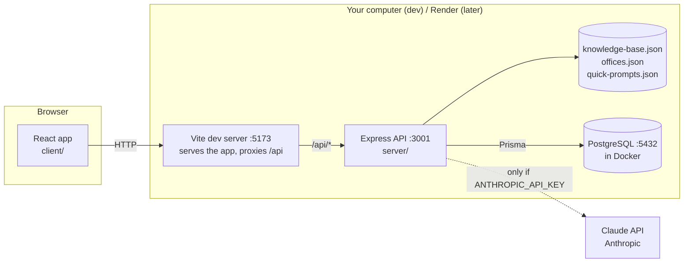

# Butch AI: architecture and codebase guide

A complete walkthrough of how Butch AI works, written for teammates who are new to the code.
Read sections 1 and 2 first. They give the big picture and follow one question through the
whole system. The rest is reference, so jump to whatever you're working on.

**Related docs:** [SCENARIOS.md](SCENARIOS.md) (every user-story scenario and how it's
tested), [SECURITY_REVIEW.md](SECURITY_REVIEW.md) (risks and fixes),
[ROADMAP.md](ROADMAP.md) (next steps), [DATA_STRATEGY.md](DATA_STRATEGY.md) (the knowledge
base), [TRACEABILITY.md](TRACEABILITY.md) (requirement → code → test).

## Contents

1. [The big picture](#1-the-big-picture)
2. [Follow one question end to end](#2-follow-one-question-end-to-end)
3. [Repository tour](#3-repository-tour)
4. [shared/: the API contract](#4-shared-the-api-contract)
5. [server/: the API](#5-server-the-api)
6. [client/: the web app](#6-client-the-web-app)
7. [Testing](#7-testing)
8. [Tooling, CI, and dependencies](#8-tooling-ci-and-dependencies)
9. [Key design decisions](#9-key-design-decisions)
10. [Known limitations](#10-known-limitations)
11. [How do I...?](#11-how-do-i)
12. [Glossary](#12-glossary)

---

## 1. The big picture

Butch AI has three running pieces: a **React web app** in the browser, an **Express API**
server, and a **PostgreSQL database**. The API answers questions using a **knowledge base**
(a JSON file of WSU facts) and, when an API key is set, the **Claude API** to phrase answers.



The code lives in one repository split into four **npm workspaces**: folders that are
each their own package but share one `node_modules` and one lockfile.

| Workspace | Package name    | What it is                                           | Runs where                      |
| --------- | --------------- | ---------------------------------------------------- | ------------------------------- |
| `shared/` | `@butch/shared` | TypeScript types and constants both sides agree on   | Imported by client and server   |
| `server/` | `@butch/server` | Express API: answers questions, logs chats, feedback | Node.js 24                      |
| `client/` | `@butch/client` | React chat interface                                 | The browser (built by Vite)     |
| `e2e/`    | `@butch/e2e`    | Gherkin acceptance tests that drive a real browser   | Playwright (your machine or CI) |

Everything is **TypeScript**. The server runs `.ts` files directly (Node 24 strips the types
as it loads them), so the server has no build step. The client is bundled by **Vite** into
plain JavaScript for browsers.

**Two modes you'll see everywhere:**

| Setting                    | Options                                                | Controlled by                          |
| -------------------------- | ------------------------------------------------------ | -------------------------------------- |
| Who writes Butch's replies | **Claude** (real AI) or **offline** (entry text as-is) | `ANTHROPIC_API_KEY`, `BUTCH_RESPONDER` |
| Where chats are saved      | **PostgreSQL** or **memory** (lost on restart)         | `DATABASE_URL`                         |

Both are set in `server/.env`. Tests always use offline + memory, so they're free, fast, and
repeatable.

---

## 2. Follow one question end to end

A student types **"Is Southside open right now?"** at noon on a Monday and presses Enter.

### In the browser

1. **`Composer.tsx`** holds the text box. Its `onKeyDown` sees Enter (without Shift, and not
   mid-way through typing with an input method like Japanese), prevents a newline, and calls
   `onSend(text)`, then clears the box.
2. **`App.tsx`** passes `onSend` as `ask`, which does two things:
   `remember(text)` (saves it to this browser's recent questions for the quick-prompt buttons)
   and `send(text)` from the chat hook.
3. **`useChat.ts` `send()`** trims the text and ignores it if empty or if a reply is already
   pending. It adds the user's bubble to `messages`, sets `status` to `'thinking'` (which
   shows "Butch is typing…" and makes the mascot bob), and calls `butchApi.chat(...)` with the
   question and the current `conversationId` (none yet on the first question).
4. **`api/butchApi.ts`** sends `POST /api/chat` with a JSON body. In development the page is
   served by Vite on port 5173, and Vite's **proxy** forwards anything under `/api` to the API
   server on port 3001, so the browser never needs cross-origin (CORS) permission.

### In the server

5. **`app.ts`** runs the request through middleware in order:
   `helmet` (security headers) → `cors` → an API-wide rate limit (100 requests/min per IP by
   default) → `express.json` (parses JSON, rejects bodies over 10 KB) → the chat router.
6. **`routes/chat.ts`**:
   - applies the stricter chat rate limit (20 questions/min per IP by default);
   - validates the body with **zod**: `message` must be 1 to 500 characters after trimming, and
     `conversationId`, if present, must be a UUID. A failure returns `400` with a readable error;
   - finds the conversation, or creates a new one if the ID is missing or unknown (for example
     after a restart with the in-memory store);
   - loads the conversation's **last 6 messages** as history (for follow-up questions);
   - **logs the question** (`store.addMessage`, role `user`);
   - calls `butch.reply(question, history, now)`;
   - **logs Butch's reply** (role `butch`, with its kind and the knowledge entries used);
   - responds with `{ conversationId, messageId, reply, kind, sources }`.
7. **`services/butch.ts` `reply()`** is the answer pipeline:
   1. **Search** the knowledge base (`retrieval.ts` `search()`) for the top 3 matches, then keep
      those scoring at least `BUTCH_CONFIDENCE_THRESHOLD` (0.6).
   2. **No confident match?** Return the fallback (`fallback.ts`): "I'd rather not guess", plus
      a link to the best-matching WSU office. **Claude is never called** for these.
   3. **Add live status** to each match (`liveStatus.ts`), e.g. "Southside Café: open right
      now, closing at 9:00 PM today."
   4. **Respond** with the configured responder (Claude or offline). If Claude throws (network,
      outage), the offline responder answers instead. If Claude declines (safety refusal, or a
      reply cut off for being too long), the fallback is used.
   5. Return the text, `kind: 'answer'`, up to 3 unique source links, and the entry IDs used.
8. **How the search scored this question** (details in [5.5](#55-knowledge-base-search-and-live-status)):
   - "Is Southside open right now?" → words `["southside", "open"]` ("is", "right", "now" are
     filler words).
   - "open" is a _time word_, so it signals an hours question but isn't used for matching.
     The topic is `["southside"]`.
   - **Southside Café** and **Southside Market** both have "southside" in their title/keywords,
     so both score 1.0. Every other entry scores 0.
9. **Live status:** it's Monday 12:00 PM in Pullman. Southside Café's Monday hours are
   7:30 AM–9:00 PM, so: _"Southside Café: open right now, closing at 9:00 PM today. Regular
   hours: Mon–Fri 7:30 AM–9:00 PM; Sat–Sun 8:30 AM–9:00 PM."_
10. **Responder:**
    - **Offline** (no API key): returns the matching entries' text with the live status. Both
      Southside locations tied, so both are shown.
    - **Claude:** receives Butch's persona instructions plus a message containing the current
      Pullman time, both facts with their live status, and the question. It writes a short,
      friendly answer from only those facts.

### Back in the browser

11. `useChat` receives the response, stores the `conversationId` for the next question, and
    adds Butch's bubble with its sources and `serverId` (so it can be rated). `status` returns
    to `'idle'`: the typing indicator disappears and the mascot stops bobbing.
12. **`ChatWindow.tsx`** scrolls the new bubble into view, and screen readers announce it
    because the chat area is an ARIA live region.
13. If the student clicks 👍, **`RatingButtons.tsx`** → `useChat.rate()` marks it selected
    immediately, then `POST /api/feedback`. The server stores one rating per reply, and changing
    to 👎 replaces it. If the save fails, the UI reverts.

### The fallback path

"How do I get a refund on my parking permit?" → words `["refund", "parking", "permit"]`. Only
"refund" matches anything (the Fall 2026 full-refund withdrawal entry), scoring 1/3 = 0.33,
which is below 0.6. So Butch falls back. `pickOffice()` compares the words with each office's
keywords: Transportation Services matches "parking" and "permit" (2), Financial Services
matches "refund" (1), so the reply points to **Transportation Services** and the WSU homepage.

---

## 3. Repository tour

```
.
├── package.json            Workspaces, root scripts, dependency overrides, install-script policy
├── package-lock.json       Exact versions of every dependency (commit it; CI installs from it)
├── tsconfig.base.json      TypeScript settings every workspace extends
├── eslint.config.js        Lint rules (TypeScript, React hooks, accessibility)
├── .prettierrc.json        Formatting style (single quotes, 100-char lines)
├── .editorconfig           Basic editor settings (spaces, LF line endings)
├── .gitattributes          Forces LF line endings so Windows/Mac diffs stay clean
├── .gitignore              Keeps secrets, builds, node_modules, PDFs out of git
├── .nvmrc                  Node version (24) for nvm and CI
├── docker-compose.yml      Local PostgreSQL database
├── .vscode/                Recommended extensions, format-on-save, debugger configs
├── .github/
│   ├── workflows/ci.yml    GitHub Actions: checks, database tests, e2e tests
│   └── pull_request_template.md
├── docs/                   These guides
├── shared/src/index.ts     API types shared by client and server
├── server/
│   ├── .env.example        Template for server/.env (your local secrets and settings)
│   ├── data/               Knowledge base, fallback offices, quick prompts (JSON)
│   ├── prisma/             Database schema and migrations
│   ├── prisma.config.ts    Tells Prisma where the schema and DATABASE_URL are
│   ├── vitest*.config.ts   Test settings (normal tests / database tests)
│   └── src/
│       ├── index.ts        Starts the server (wiring)
│       ├── app.ts          Builds the Express app (middleware + routes)
│       ├── config.ts       Reads and validates environment variables
│       ├── routes/         HTTP endpoints: chat, feedback
│       ├── services/       The answer pipeline (butch.ts) and fallback
│       ├── knowledge/      Knowledge schema, loading, search, live status
│       ├── responders/     Claude and offline reply writers, Butch's persona
│       ├── store/          Where chats are saved: interface, memory, PostgreSQL
│       ├── lib/            Pullman time-zone helpers
│       ├── generated/      Prisma client (auto-generated, not in git)
│       └── test/           Test helpers
├── client/
│   ├── index.html          Page shell
│   ├── vite.config.ts      Dev server, /api proxy, test settings
│   ├── public/favicon.svg
│   └── src/
│       ├── main.tsx        Mounts <App /> into the page
│       ├── App.tsx         Page layout; connects hooks to components
│       ├── index.css       Tailwind + WSU design tokens
│       ├── api/            HTTP client for the API
│       ├── hooks/          Chat state, quick prompts
│       ├── components/     UI pieces
│       └── test/           MSW fake API + test setup
└── e2e/
    ├── playwright.config.ts
    ├── features/           One .feature file per user story (Gherkin)
    └── steps/              Step definitions that run those scenarios
```

---

## 4. `shared/`: the API contract

`shared/src/index.ts` defines what goes over the wire:

| Type                       | Used for                                                             |
| -------------------------- | -------------------------------------------------------------------- |
| `ChatRequest`              | `POST /api/chat` body: `message`, optional `conversationId`          |
| `ChatResponse`             | Its reply: `conversationId`, `messageId`, `reply`, `kind`, `sources` |
| `ReplyKind`                | `'answer'` (from the knowledge base) or `'fallback'` (not confident) |
| `SourceLink`               | `{ label, url }` shown under a reply                                 |
| `FeedbackRequest/Response` | `POST /api/feedback`: `messageId`, `rating`                          |
| `Rating`                   | `'up'` or `'down'`                                                   |
| `QuickPrompt(sResponse)`   | FAQ buttons                                                          |
| `ApiError`                 | `{ error }` body on any 4xx/5xx                                      |
| `MAX_QUESTION_LENGTH`      | 500: enforced by the text box _and_ the server                       |

**Why a shared package?** If someone renames a field, both the client and the server stop
compiling right away, instead of the chat silently breaking at runtime. Import it with
`import type { ChatResponse } from '@butch/shared'`.

---

## 5. `server/`: the API

### 5.1 Startup (`src/index.ts`)

`npm run dev` runs `prisma generate` (via the `predev` script), then
`node --watch --env-file-if-exists=.env src/index.ts`. `--watch` restarts on file changes and
`--env-file-if-exists` loads `server/.env`. Startup order:

1. `loadConfig()` reads and validates environment variables and **stops with a clear error**
   if something's wrong (see 5.2).
2. Loads the three JSON data files, validated with zod. A typo, bad time, non-https link, or
   duplicate ID **stops the server** with the file and field named.
3. `createStore()`: with `DATABASE_URL`, connects to PostgreSQL and checks it with `SELECT 1`.
   If it can't connect, it exits with instructions ("Is Docker running? npm run db:up").
   Without `DATABASE_URL`, it uses memory.
4. Builds `Butch` (the answer pipeline) with the chosen responder plus an offline backup.
5. Builds the Express app and listens. It logs the port, responder, storage, and knowledge
   entry count.
6. On Ctrl+C (`SIGINT`/`SIGTERM`), it closes the server and database connections.

### 5.2 Configuration (`src/config.ts`)

All server settings come from environment variables, which in development means `server/.env`.
They're validated by a zod schema. Blank values (`FOO=`) count as unset.

| Variable                     | Default                   | What it does                                                             |
| ---------------------------- | ------------------------- | ------------------------------------------------------------------------ |
| `NODE_ENV`                   | `development`             | `production` turns on proxy trust and forbids test settings              |
| `PORT`                       | `3001`                    | API port                                                                 |
| `CLIENT_ORIGIN`              | `http://localhost:5173`   | The only website allowed to call the API from a browser (CORS)           |
| `RATE_LIMIT_PER_MINUTE`      | `20`                      | Questions per minute per IP. Other API calls get 5x this.                |
| `DATABASE_URL`               | _(unset = memory)_        | PostgreSQL connection string                                             |
| `BUTCH_RESPONDER`            | `auto`                    | `auto` (Claude if a key is set), `claude`, or `offline`                  |
| `ANTHROPIC_API_KEY`          | _(unset)_                 | Claude API key. **Secret.**                                              |
| `ANTHROPIC_MODEL`            | `claude-opus-5`           | Which Claude model                                                       |
| `ANTHROPIC_EFFORT`           | _(unset = model default)_ | `low`…`max`: how hard Claude thinks (speed/cost vs. thoroughness)        |
| `BUTCH_CONFIDENCE_THRESHOLD` | `0.6`                     | Minimum search score to answer instead of falling back                   |
| `BUTCH_FAKE_NOW`             | _(unset)_                 | Dev demo: pretend it's this time. Refused in production.                 |
| `BUTCH_TEST_HOOKS`           | `false`                   | Honors the `X-Butch-Fake-Now` header (e2e tests). Refused in production. |

`loadConfig()` also refuses combinations that can't work: `BUTCH_RESPONDER=claude` without a
key, or test settings in production.

### 5.3 HTTP layer (`src/app.ts`, `src/routes/`)

`createApp()` builds the app **without starting it**, so tests can call it directly with
Supertest. Middleware runs in this order:

| Order | Middleware                        | Why                                                                           |
| ----- | --------------------------------- | ----------------------------------------------------------------------------- |
| 1     | `trust proxy` (production only)   | Behind Render's proxy, use the real client IP for rate limits                 |
| 2     | `helmet()`                        | Security headers (no sniffing, no framing, etc.)                              |
| 3     | `cors({ origin: CLIENT_ORIGIN })` | Only our website may call the API from a browser                              |
| 4     | API-wide rate limit               | 5 × `RATE_LIMIT_PER_MINUTE` requests/min per IP on every `/api` route         |
| 5     | `express.json({ limit: '10kb' })` | Parse JSON bodies; reject huge ones                                           |
| 6     | Routes (below)                    |                                                                               |
| 7     | `/api` 404 handler                | Unknown API paths return `{ error: 'Not found.' }`                            |
| 8     | Error handler                     | Bad JSON → 400, too large → 413, anything else → 500 without internal details |

**Endpoints**

| Method & path            | Body → response                                                                        | Errors                                      |
| ------------------------ | -------------------------------------------------------------------------------------- | ------------------------------------------- |
| `POST /api/chat`         | `{ message, conversationId? }` → `{ conversationId, messageId, reply, kind, sources }` | 400 invalid, 429 rate-limited               |
| `POST /api/feedback`     | `{ messageId, rating }` → same back                                                    | 400 invalid, 404 not one of Butch's replies |
| `GET /api/quick-prompts` | → `{ prompts: [{ id, prompt }] }`                                                      |                                             |
| `GET /api/health`        | → `{ status: 'ok', responder, storage }`                                               |                                             |

Express 5 automatically sends errors thrown inside `async` handlers to the error handler, so
routes don't need try/catch.

**Test hook:** when `BUTCH_TEST_HOOKS=true`, a request header `X-Butch-Fake-Now:
2026-09-22T00:00:00-07:00` makes that one request think it's midnight. The e2e suite uses this
to test "open at noon" and "closed at midnight." It's off by default and refused in production.

### 5.4 The answer pipeline (`src/services/`)

- **`butch.ts`**: the `Butch` class, described in section 2 step 7. Its dependencies (store,
  offices, responder, backup responder, threshold) are passed in through the constructor,
  which makes it easy to test with fakes.
- **`fallback.ts`**: `buildFallback()` writes the "rather not guess" message. `pickOffice()`
  finds the office in `offices.json` whose keywords overlap the question most. With no overlap,
  only the WSU homepage is linked.

### 5.5 Knowledge base, search, and live status (`src/knowledge/`, `src/lib/`)

**`schema.ts`** defines, with zod, what a valid entry looks like:

```jsonc
{
  "id": "dining-southside-cafe", // lowercase-with-dashes, unique
  "category": "dining", // academic-calendar | admissions | campus-life | dining | events | library | recreation | services
  "title": "Southside Café", // for hours entries: the place name
  "content": "Southside Café is one of…", // the fact, as Butch should say it
  "keywords": ["southside", "dining hall", "breakfast"],
  "links": [
    { "label": "WSU Dining: Facility Hours", "url": "https://dining.wsu.edu/facility-hours/" },
  ],
  "lastVerified": "2026-09-25",
  "hours": { "mon": [["07:30", "21:00"]], "sat": [["08:30", "21:00"]] }, // optional; missing day = closed
  "date": "2026-09-22",
  "endDate": "2026-09-24", // optional
}
```

Validation enforces https-only links, `HH:MM` times with close after open, ISO dates, and
`endDate` requiring `date`. `schema.ts` also defines the `offices.json` and
`quick-prompts.json` formats. **`loadData.ts`** reads and validates all three files.

**`retrieval.ts`** is keyword search, in two steps:

**Step 1: `tokenize(text)`** turns text into comparable words:

1. Strip accents ("Café" → "Cafe") and lowercase.
2. Drop possessives and apostrophes ("Dad's" → "Dad").
3. Split on anything that isn't a letter or digit.
4. Drop 1-letter words and **stopwords**: filler like "is", "the", "how", "can", "tell", "me",
   and also "wsu" and "butch" (every question is about WSU, so they don't help).
5. **Stem** simple plurals: "classes" → "class", "hours" → "hour", "libraries" → "library".

**Step 2: `search(entries, question)`** scores every entry:

- The question's words split into **topic words** and **time words** (open, close, hours,
  time, tonight, tomorrow, weekend, the weekday names…). Time words mean "they're asking about
  hours" but aren't used for matching. Otherwise "What time does the library close?" would
  partly match every dining hall.
- For each topic word: **1 point** if it's in the entry's title or keywords (a strong match),
  **0.4** if only in its content text (a weak match).
- **Score = points ÷ number of topic words.** 1.0 means every topic word strongly matched.
- Sort by score. Ties go first to entries with hours (if it's an hours question), then to the
  entry whose date is **nearest to today**. That's how "When is the last day to drop a class?"
  picks Fall 2026 in September but Spring 2027 in January.
- Return the top 3. The pipeline then drops anything under the 0.6 threshold.

| Question                                      | Topic words            | Best match (score)                 |
| --------------------------------------------- | ---------------------- | ---------------------------------- |
| What is the last day to drop a class?         | last, day, drop, class | Fall 2026 drop deadline (1.0)      |
| Tell me about the amenities in the rec center | amenity, rec, center   | SRC amenities (1.0)                |
| What classes should I take?                   | class, take            | Drop deadline (0.5) → **fallback** |
| tell me about sigma nu at wsu                 | sigma, nu              | nothing → **fallback**             |

**`liveStatus.ts`** computes time-sensitive facts **in code**, because language models are
unreliable at date math:

- **Hours** (`describeHours`): gets the current day and time **in Pullman**, finds whether
  "now" is inside one of today's open periods (some places, like the pool, have several per
  day), and says "open right now, closing at X", "opens today at X", or "next opens tomorrow
  (Saturday) at X". It always appends a weekly summary, grouping days with identical hours
  ("Mon–Fri 7:30 AM–9:00 PM; Sat–Sun closed").
- **Dates** (`describeDate`): counts days between Pullman's today and the date: "was 3 days
  ago, so this date has already passed", "is 56 days from today", "That's today!". Multi-day
  events get "happening now", "starts in 7 days", or "already happened".

**`lib/pullmanTime.ts`** converts any moment to Pullman's day of week, minutes since midnight,
and calendar date using `Intl.DateTimeFormat` with the `America/Los_Angeles` time zone. That
handles daylight saving time correctly, so the server's own time zone doesn't matter.

### 5.6 Responders (`src/responders/`)

A **responder** turns retrieved facts into Butch's reply. The interface (`types.ts`) is one
method, `respond({ question, history, facts, now })`, which returns `{ text, answered }`.

- **`offlineResponder.ts`**: no AI. It returns the top match's content with its live status,
  plus the second match if it tied. For hours entries the status comes first. It's used when
  there's no API key, as the backup when Claude fails, and by every test.
- **`claudeResponder.ts`**: calls Anthropic's Messages API through the official
  `@anthropic-ai/sdk`:
  - `system`: Butch's persona (`persona.ts`). Answer only from the facts, never invent dates,
    hours, or links, keep it to 2–4 sentences, stay on WSU topics, send emergencies to 911,
    and be friendly with Cougar spirit.
  - `messages`: earlier turns from this conversation, then the new message:

    ```
    <current_time>Monday, September 21, 2026 at 12:00 PM (Pullman, WA)</current_time>

    <wsu_facts>
    <fact title="Southside Café" source="WSU Dining: Facility Hours">
    Southside Café is one of WSU Dining Services' three dining centers…
    Live status: Southside Café: open right now, closing at 9:00 PM today. Regular hours: …
    </fact>
    </wsu_facts>

    <question>Is Southside open right now?</question>
    ```

    The current time goes in the message, not the system prompt, so the system prompt stays
    identical across requests. That lets Anthropic's prompt caching reuse it.

  - `max_tokens: 4096`: plenty for a short answer plus the model's thinking, and it caps what
    one request can cost.
  - `output_config.effort`: only sent if `ANTHROPIC_EFFORT` is set.
  - **Refusal fallback** (for `claude-opus-5`): if Claude's safety filter declines, Anthropic
    retries on a fallback model inside the same call (`fallbacks: 'default'`).
  - Results: a `refusal`, a reply cut off at `max_tokens`, or empty text all count as **not
    answered**, so Butch gives the fallback message. Errors (network, rate limit, outage) are
    caught in `butch.ts`, which switches to the offline responder.
- **`index.ts`** `createResponder(config)` builds the right one. The SDK client has a 30-second
  timeout and 1 retry.

### 5.7 Storage (`src/store/`, `prisma/`)

**`types.ts`** defines the `Store` interface, and routes use only this interface:

| Method                                            | Purpose                                                   |
| ------------------------------------------------- | --------------------------------------------------------- |
| `listKnowledge()`                                 | The knowledge base (currently the JSON loaded at startup) |
| `createConversation()` / `conversationExists(id)` | Anonymous chat sessions                                   |
| `addMessage(msg)` / `getMessage(id)`              | Log a question or reply (FR-09)                           |
| `recentMessages(conversationId, n)`               | Last _n_ messages, oldest first (history for follow-ups)  |
| `setRating(id, rating)` / `getRating(id)`         | One rating per reply; setting again replaces it (FR-08)   |
| `close()`                                         | Release database connections                              |

Two implementations:

- **`memoryStore.ts`**: JavaScript `Map`s. No setup; everything is lost on restart. Used by
  tests, and when `DATABASE_URL` isn't set.
- **`prismaStore.ts`**: PostgreSQL through **Prisma**, a type-safe database library. It
  creates a `PrismaClient` with the `pg` driver adapter. All queries are Prisma method calls
  (no hand-written SQL), so user input can't inject SQL.

**`storeContract.ts`** is one test suite run against **both** stores (`memoryStore.test.ts`
and `prismaStore.db.test.ts`), which proves they behave the same.

**Database schema** (`prisma/schema.prisma`):

| Table           | Columns                                                                                                                                                                         | Notes                                          |
| --------------- | ------------------------------------------------------------------------------------------------------------------------------------------------------------------------------- | ---------------------------------------------- |
| `conversations` | `id` (UUID), `created_at`                                                                                                                                                       | Deleting one deletes its messages and feedback |
| `messages`      | `id` (UUID), `seq` (auto-number for exact ordering), `conversation_id`, `role` (user/butch), `text`, `kind` (answer/fallback, replies only), `entry_ids` (text[]), `created_at` | Indexed by conversation + seq                  |
| `feedback`      | `message_id` (UUID, primary key = one per reply), `rating` (up/down), `created_at`, `updated_at`                                                                                |                                                |

There are **no user-identifying columns** (no names, emails, or IPs), per FR-09.

**Prisma workflow:**

- `schema.prisma` is the source of truth. After editing it, `npm run db:migrate -- --name
what_changed` creates a SQL migration in `prisma/migrations/` (commit it) and applies it.
- `prisma generate` writes a typed client to `src/generated/prisma/`. It's **not committed**;
  it's regenerated automatically before `dev`, `start`, `test`, and `typecheck`.
- `prisma.config.ts` tells Prisma where the schema is and loads `DATABASE_URL` from `.env`.
- `npm run db:studio` opens a browser UI to view and edit the tables.

### 5.8 Data files (`server/data/`)

| File                  | Contents                                                             |
| --------------------- | -------------------------------------------------------------------- |
| `knowledge-base.json` | 42 WSU facts (see DATA_STRATEGY.md for sources and how to add more)  |
| `offices.json`        | 7 offices + the WSU homepage, each with keywords, used for fallbacks |
| `quick-prompts.json`  | The 7 site-wide FAQ buttons                                          |

---

## 6. `client/`: the web app

### 6.1 Build and dev setup

- **Vite** serves the app with hot reload (`npm run dev -w client`) and bundles it for
  production (`npm run build` → `client/dist/`).
- **`vite.config.ts`**: the React plugin, the Tailwind plugin, the `/api` proxy (target from
  `BUTCH_API_PROXY`, default `http://localhost:3001`), and Vitest settings.
- **`VITE_API_URL`** (in `client/.env.local`): where the API is in production. Only variables
  starting with `VITE_` reach the browser, **so never put secrets in them**.
- `index.html` → `src/main.tsx` → `<App />`.

### 6.2 Component tree

```
App                       page layout, wires hooks to components
├── Header                crimson bar: MascotAvatar (idle/thinking), title, "New conversation"
├── ChatWindow            scrollable conversation (ARIA live "log")
│   ├── Intro             big mascot + tagline, only on a fresh conversation
│   ├── MessageBubble ×n  user (right, crimson) or Butch (left, white)
│   │   ├── SourceList    "Sources" or "Where to get help" links
│   │   └── RatingButtons thumbs up/down (only on real replies)
│   └── TypingIndicator   "Butch is typing…" + thinking mascot, while waiting
├── QuickReplyBar         FAQ buttons (your recent questions first)
├── Composer              question box + Send
└── footer note           mistakes/privacy/not-official disclaimer
```

### 6.3 State (`src/hooks/`)

**`useChat(api)`** owns the conversation:

- **State:** `messages` (starts with Butch's greeting) and `status` (`idle` / `thinking`).
- **Refs** (values that change without re-rendering):
  - `conversationId`: from the server's first reply, sent with later questions.
  - `inFlight`: blocks a second question while one is pending.
  - `generation`: a counter bumped by "New conversation". A reply that arrives for an older
    generation is thrown away, so an old answer can't pop into a fresh chat.
- **`send(text)`**: see section 2 steps 3 and 11. On error, it adds an error bubble. For 4xx
  errors (like the rate limit) it shows the server's message; otherwise "couldn't reach the
  Butch server."
- **`reset()`**: new generation, forget `conversationId`, back to just the greeting. The server
  keeps the old conversation (US-10).
- **`rate(id, rating)`**: optimistic update, then `POST /api/feedback`, reverting on failure.

**`useQuickPrompts(api)`** loads the site-wide prompts once, and keeps this browser's last 5
questions in `localStorage` (`butch.recentQuestions`). It shows up to 2 of them first (US-05
S2), then the site-wide list without duplicates. All storage access is wrapped in try/catch,
because private browsing can block it.

### 6.4 API client (`src/api/butchApi.ts`)

`butchApi` has three functions (`chat`, `sendFeedback`, `quickPrompts`) built on one `request()`
helper. It throws `ApiRequestError` with `status` 0 for network failures, or the server's
`{ error }` message for 4xx/5xx. Components receive the API through hooks, so tests can swap it.

### 6.5 Styling and the WSU theme

- **Tailwind CSS v4**: styles are utility classes in the JSX (`bg-wsu-crimson px-4 rounded-2xl`).
- **Design tokens** live in `src/index.css` under `@theme`, so change a color there and every
  component updates:
  `wsu-crimson #A60F2D`, `wsu-crimson-dark #850C24` (hover), `wsu-gray #4D4D4D`,
  `wsu-black-80/60/40/30`, `wsu-surface #F6F6F6`, `wsu-midnight #002D61`.
  Font: **Montserrat** (WSU's web font), bundled locally.
- WSU brand rule: **don't use lighter tints of crimson**. Use the darker shade for hover.
- Animations (`butch-bob`, `typing-dot`) only run with `motion-safe:`, so users who've asked
  their OS for reduced motion don't see them.

### 6.6 Accessibility (NFR-05) built in

- The chat is a **`role="log"` live region**, so screen readers announce new messages and "Butch
  is typing…". It's focusable so keyboard users can scroll it.
- Each bubble has hidden "You said:" / "Butch said:" prefixes for screen readers.
- Every control has a label: the text box ("Ask Butch a question"), Send, New conversation,
  Thumbs up/down (with `aria-pressed`), and the suggested-questions list.
- Send uses `aria-disabled` instead of `disabled`, so it stays focusable and discoverable.
- There's a visible crimson focus ring everywhere (white on the crimson header).
- Links are underlined and announce "(opens in a new tab)".
- The avatar and icons are decorative (`aria-hidden`); the text carries the meaning.
- Colors meet WCAG AA contrast. Automated checks: `eslint-plugin-jsx-a11y` while coding,
  axe-core in the e2e suite.

### 6.7 Notes for front-end design work

Most visual work happens in `src/components/` and `src/index.css`. Things to keep intact,
because tests and accessibility depend on them:

- **Accessible names**: text box label, "Send", "New conversation", "Thumbs up/down",
  "Suggested questions", "Conversation with Butch".
- **`data-testid`** (`message`, `typing-indicator`, `butch-avatar`) and **`data-role`** /
  **`data-state`** attributes.
- **`MascotAvatar`'s `state` prop** (`idle` / `thinking`). To add real art or Lottie
  animations, change what it renders inside and keep the prop.

If a design change breaks an e2e step, update the step, not just the test ID, and keep the
page accessible.

---

## 7. Testing

| Layer                | Tool                                 | Files                                   | Command           | Needs           |
| -------------------- | ------------------------------------ | --------------------------------------- | ----------------- | --------------- |
| Server unit + API    | Vitest, Supertest                    | `server/src/**/*.test.ts` (61 tests)    | `npm test`        | nothing         |
| Database             | Vitest + real PostgreSQL             | `server/src/**/*.db.test.ts` (4 tests)  | `npm run test:db` | `npm run db:up` |
| UI components        | Vitest, React Testing Library, MSW   | `client/src/**/*.test.tsx` (15 tests)   | `npm test`        | nothing         |
| Acceptance (Gherkin) | Playwright, playwright-bdd, axe-core | `e2e/features/*.feature` (22 scenarios) | `npm run e2e`     | Chrome          |

**Test doubles** (stand-ins that keep tests fast, free, and repeatable):

- **Offline responder**: the "stubbed model" from the Milestone 1 plan. Tests never call Claude.
- **Fake Anthropic client** in `claudeResponder.test.ts`: checks the exact request sent to
  Claude and how each kind of response is handled.
- **MSW (Mock Service Worker)** in client tests: a fake API, so UI tests don't need the server.
- **Pinned clocks**: `buildTestApp({ now })` in server tests, and the `X-Butch-Fake-Now` header
  in e2e tests.

**How e2e works:** each `.feature` file holds Given/When/Then scenarios from the requirements.
`bddgen` turns them into Playwright tests (in `e2e/.features-gen/`), matching each step line to
a function in `e2e/steps/`. `playwright.config.ts` starts its own API (offline, in-memory, test
hooks on, port 3199) and web app (port 5199), then drives Chrome through each scenario. Details
per scenario: [SCENARIOS.md](SCENARIOS.md).

---

## 8. Tooling, CI, and dependencies

- **TypeScript** (`npm run typecheck`): strict mode everywhere. `erasableSyntaxOnly` bans
  TS-only syntax (enums, namespaces) that Node can't strip.
- **ESLint** (`npm run lint`): recommended JS/TS rules, React hooks rules, jsx-a11y
  accessibility rules.
- **Prettier** (`npm run format`): formatting. VS Code formats on save (`.vscode/settings.json`).
- **`npm run check`**: lint + typecheck + tests. Run it before every PR.
- **GitHub Actions** (`.github/workflows/ci.yml`), on every PR and every push to `main`:
  1. `checks`: format check, lint, typecheck, unit tests, build.
  2. `database`: starts PostgreSQL, applies migrations, runs database tests.
  3. `e2e`: installs Playwright's Chromium and runs every scenario. It uploads the report if
     something fails.
- **Dependencies:** `package-lock.json` pins exact versions and CI installs with `npm ci`. In
  root `package.json`:
  - `overrides` force patched versions of two packages used inside Prisma's CLI (security
    fixes, see SECURITY_REVIEW.md).
  - `allowScripts` records which packages may run install scripts (an npm 12 safety feature):
    Prisma yes, MSW no.

---

## 9. Key design decisions

| Decision                                   | Why                                                                           |
| ------------------------------------------ | ----------------------------------------------------------------------------- |
| Search + Claude (RAG), no model training   | Facts change every semester. Editing data beats retraining (NFR-07).          |
| Hours and dates computed in code           | "Open right now?" must be exact; language models are unreliable at date math. |
| Confidence threshold before calling Claude | No guessing (FR-05), and unanswerable questions cost nothing.                 |
| Offline responder                          | Works with no key, and is the deterministic stub for tests.                   |
| `Store` interface: PostgreSQL or memory    | Real persistence in dev/prod; tests and no-Docker setups still work.          |
| Shared types package                       | Client/server mismatches become compile errors.                               |
| Node runs TypeScript directly              | No server build step; simpler for a student team.                             |
| Model and effort set in `.env`             | Trade cost vs. quality without code changes.                                  |
| Refusal fallback + cut-off handling        | A declined or truncated reply becomes a polite fallback, not garbage.         |
| e2e on its own ports, offline, in memory   | Tests never touch your dev database or cost money.                            |

## 10. Known limitations

- **Offline mode only repeats entries.** Without an API key, a reply is the matching entry's
  text word for word.
- **Only knows 42 facts.** Anything else falls back (e.g. "Sigma Nu", "jobs"). Add entries, or
  add Claude's web search limited to wsu.edu (see ROADMAP.md).
- **Keyword search** misses paraphrases with no shared words ("grub" for dining). Add keywords,
  or move to embeddings (pgvector) later.
- **Follow-ups** like "when does it close?" have no topic words, so search can't tell which
  place you mean.
- **Regular hours only.** Holiday and break hours aren't modeled; entries warn about this.
- **No admin screen yet** (US-08, US-09). Use `npm run db:studio` locally.
- **No streaming.** Replies appear all at once.
- **Rate limits are per server instance and in memory.** Fine for one server, not for several.

---

## 11. How do I...?

**Add a WSU fact:** edit `server/data/knowledge-base.json` (format in 5.5, steps in
DATA_STRATEGY.md). Run `npm test -w server` to validate, then ask Butch.

**Add a fallback office:** add it to `server/data/offices.json` with good `keywords`.

**Change the FAQ buttons:** edit `server/data/quick-prompts.json`.

**Change how Butch talks:** edit `server/src/responders/persona.ts` (Claude mode only).

**Change the colors or font:** edit the `@theme` block in `client/src/index.css`.

**Add an API endpoint:**

1. Add request/response types to `shared/src/index.ts`.
2. Create a router in `server/src/routes/` and validate the input with zod.
3. Mount it in `server/src/app.ts`.
4. Add a function to `client/src/api/butchApi.ts`.
5. Add Supertest tests in `server/src/app.test.ts`.

**Store something new in the database:**

1. Edit `server/prisma/schema.prisma`.
2. Run `npm run db:migrate -- --name add_something`.
3. Add methods to the `Store` interface and **both** stores.
4. Add contract tests in `storeContract.ts`.

**Add a Gherkin scenario:**

1. Write it in the right `e2e/features/*.feature` file.
2. Run `npm run e2e:list -w e2e`. `bddgen` reports any steps that don't have code yet.
3. Add those steps in `e2e/steps/`.

**Try a different Claude model or effort:** set `ANTHROPIC_MODEL` / `ANTHROPIC_EFFORT` in
`server/.env` and restart.

**Demo "closed at midnight" by hand:** set `BUTCH_FAKE_NOW=2026-09-22T00:00:00-07:00` in
`server/.env` and restart.

**Debug the server:** in VS Code's Run and Debug panel, choose "Debug API server" and set
breakpoints.

**Reset the database:** `npm run db:down`, then
`docker volume rm butch-ai_butch-db-data`, then `npm run db:up` and `npm run db:migrate`.
**This deletes all saved chats.**

## 12. Glossary

| Term                   | Meaning                                                                                    |
| ---------------------- | ------------------------------------------------------------------------------------------ |
| **RAG**                | Retrieval-augmented generation: look up relevant facts, then have the AI answer from them. |
| **Retrieval / search** | Finding the knowledge entries that match a question (`retrieval.ts`).                      |
| **Responder**          | What writes the reply from retrieved facts: Claude or offline.                             |
| **Fallback**           | Butch's "I'd rather not guess" reply with a link to the right office.                      |
| **Live status**        | A computed sentence like "open right now" or "3 days ago".                                 |
| **Store**              | Where chats and ratings are saved (memory or PostgreSQL).                                  |
| **Prisma**             | The database library: schema, migrations, typed queries, Studio.                           |
| **Migration**          | A versioned SQL change to the database structure (`prisma/migrations/`).                   |
| **Middleware**         | A function every request passes through in Express (security headers, rate limits…).       |
| **zod**                | Library that validates data shapes (env vars, request bodies, JSON files).                 |
| **Workspace**          | One of the four packages in this repo (npm workspaces).                                    |
| **Gherkin**            | Given/When/Then scenario format used for acceptance tests.                                 |
| **MSW**                | Mock Service Worker: a fake API for UI tests.                                              |
| **Live region**        | Part of a page that screen readers announce automatically when it changes.                 |
| **Rate limit**         | Maximum requests per minute from one IP; extra ones get HTTP 429.                          |
| **CORS**               | Browser rule controlling which websites may call an API.                                   |
